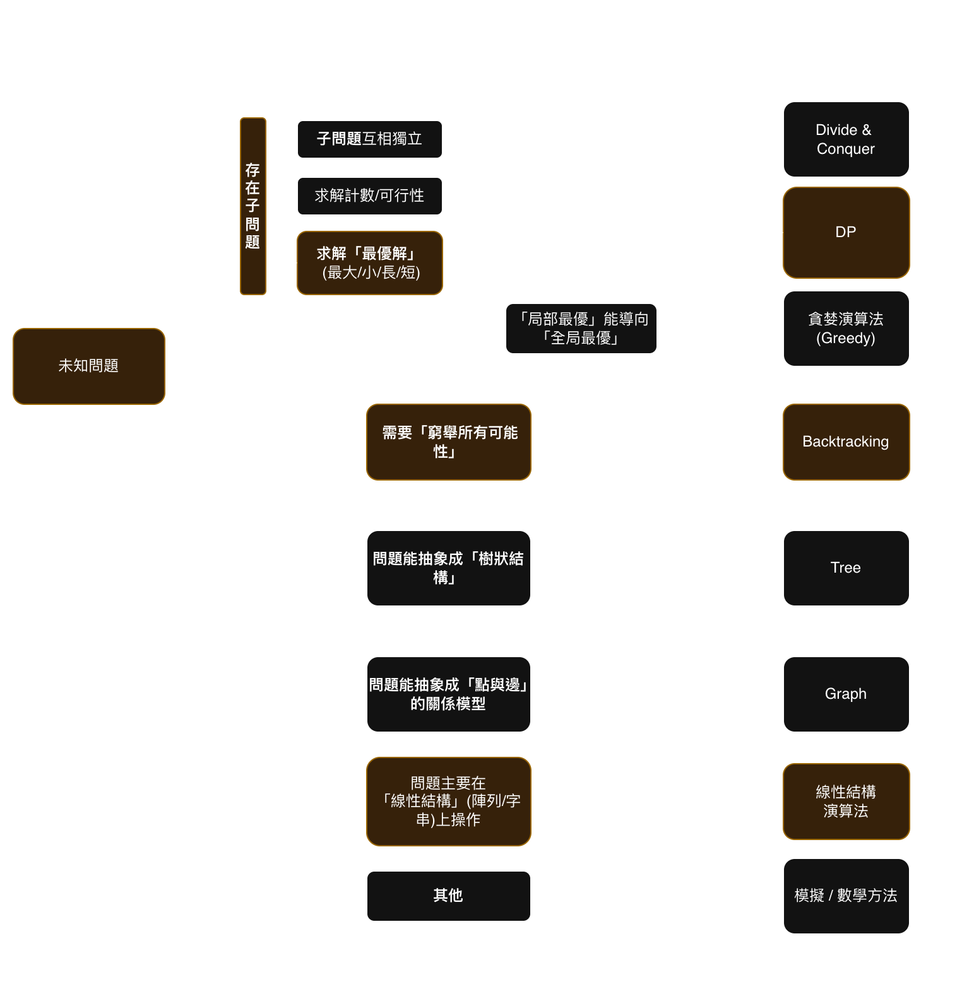
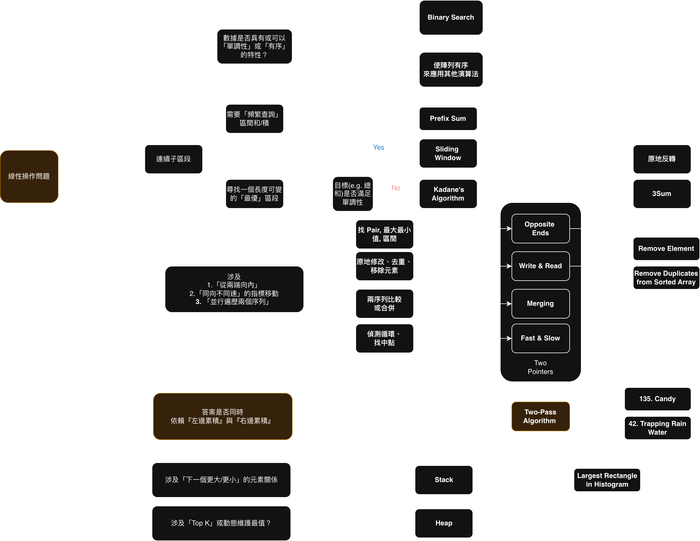

# Leetcode 123. Best Time to Buy and Sell Stock III
## 模式辨識



## 解法 1. 重疊子問題 + DP

> 可以把問題拆分成兩個重疊子問題，一個由左到右minPrice取最大利潤，另外一個由右到左用maxPrice取最大利潤
> 

```
  -------------->
3,[3,5,0,0,3,1,4]
^

  <--------------
  [3,3,5,0,0,3,1],4
                  ^
```
- 第一個位置 `3` 與最後一個位置 `4` 不能夠在這兩個位置完成買賣，由於目標是計算「買賣」的最大利潤


```python
class Solution:
    def maxProfit(self, prices: List[int]) -> int:
        
        n = len(prices)
        # 沒辦法買賣
        if n < 2:
            return 0

        # 1. 計算 left_profit[i]：從左到右
        # left_profit[i] = 從第 0 天到第 i 天，只進行一次交易的最大利潤
        left_profit = [0] * n
        min_price = prices[0]

        for i in range(1, n):
            # 到目前為止的最低買入價
            min_price = min(prices[i], min_price)
            # 在今天賣出的利潤
            profit = prices[i] - min_price
            # 今天的最大利潤 = max(昨天的最大利潤, 今天賣出的利潤)
            left_profit[i] = max(left_profit[i-1], profit)

        # 2. 計算 right_profit[i]：從右到左
        # right_profit[i] = 從第 i 天到第 n-1 天，只進行一次交易的最大利潤
        right_profit = [0] * n
        max_price = prices[n-1]

        for i in range(n - 2, -1, -1): # 從倒數第二天開始
            # 到目前為止的最高賣出價
            max_price = max(prices[i], max_price)
            # 在今天買入的利潤
            profit = max_price - prices[i]
            # 今天的最大利潤 = max(明天的最大利潤, 今天買入的利潤)
            right_profit[i] = max(right_profit[i+1], profit)

        # 3. 合併結果
        # 遍歷所有分割點 i，找出 left_profit[i] + right_profit[i] 的最大值
        max_profit = 0
        for i in range(n):
            max_profit = max(max_profit, left_profit[i] + right_profit[i])
            
        return max_profit
```


### 解法2. Backtrack + DP
> 解法： 現在的位置 + 計數 + 是否持有中


```python
class Solution:
    def maxProfit(self, prices: List[int]) -> int:
        n = len(prices)
        memo = {}

        def dfs(curr_idx, count, holding):
            if curr_idx == n or count == 0:
                return 0
            
            key = (curr_idx, count, holding)
            if key in memo:
                return memo[key]

            wait_profit = dfs(curr_idx + 1, count, holding)

            if holding:
                sell_profit = prices[curr_idx] + dfs(curr_idx + 1, count-1, False)
                result = max(wait_profit, sell_profit)
            else:
                buy_profit = dfs(curr_idx + 1, count, True) - prices[curr_idx]
                result = max(wait_profit, buy_profit)

            memo[key] = result
            return result

        return dfs(0, 2, False)
```


### 相似問題

[Leetcode 135. Candy](https://leetcode.com/problems/candy/?envType=study-plan-v2&envId=top-interview-150)