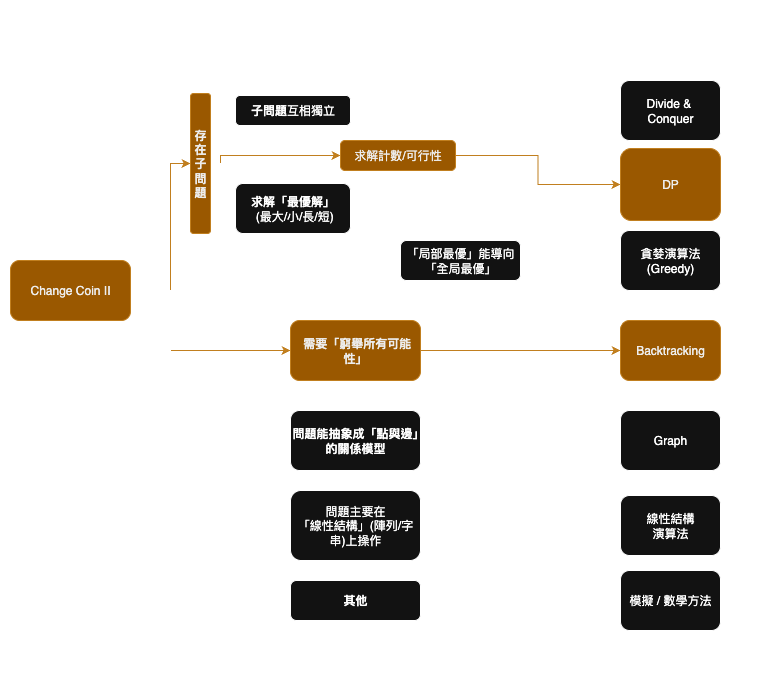
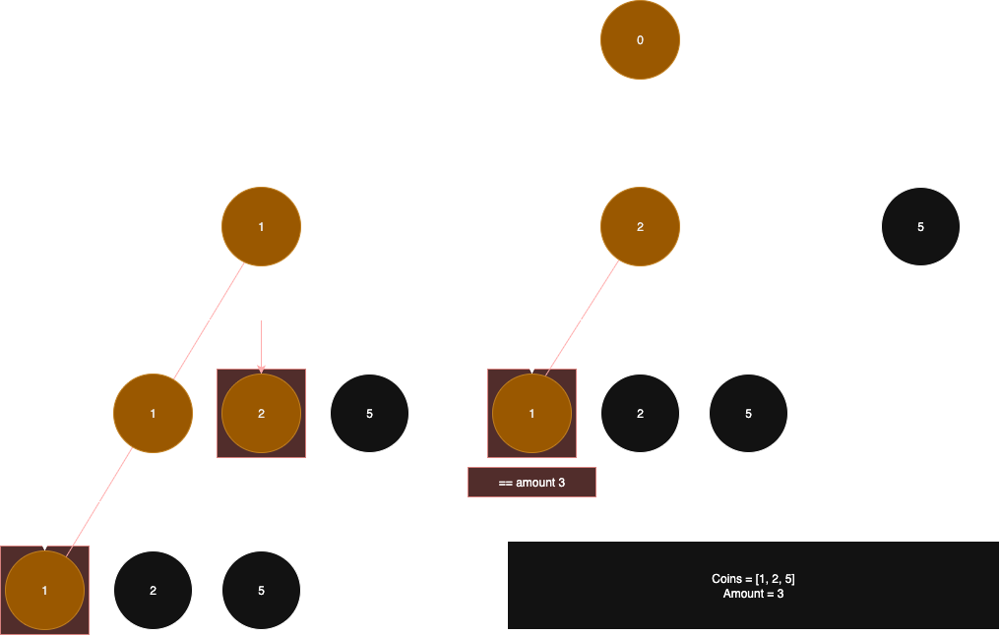
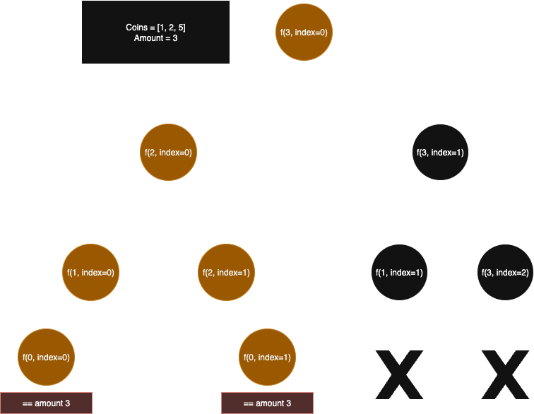

# Leetcode 518. Coin Changes II
## 模式辨識



在 Change Coin II 我們可以快速的將問題歸類到 DP 問題或 Backtracking 問題，事實上，Change Coin II 這題的最佳解離不開DP, 但對於模式辨識的過程會是在面試的重要關卡，因此在本筆記中，我們會介紹幾種解題思路，幫助讀者能夠深入淺出的理解這類題型。

> 面試官不想看到一個只會套模板的機器人，他想看到的是一個理解問題本質、能夠清晰闡述思考過程的工程師。 「模式識別 (Pattern Recognition)」 是經驗和能力的體現。 「死記硬背 (Rote Memorization)」 則是缺乏理解的表現。 你需要做的，就是向面試官展示前者。 錯誤的示範 👎: 面試官: "請解這道題。" 你: "喔，這題是完全背包問題，很簡單。" (然後開始默寫程式碼) 這種方式風險極高。如果面試官稍微改動一下題目條件，你可能就無法應對了。 正確的示範 👍: 你應該把「意識到這是完全背包問題」當作你思考過程中的一個閃光點或加速器，而不是思考的起點。你依然要從第一性原理出發，向面試官展示你的推導過程。


## 分析步驟
### Step1. 從最直覺的 Backtracking 方法開始, 先分析題型的解法：


在這個直覺的演算法中，核心思想是：在每一步，從所有硬幣中選擇一個，一直加到最終達到目標數目為止。組成 amount == 3 的組合有三項，[1, 1, 1], [1, 2], [2, 1]. 然而根據題目，[1, 2] 與 [2, 1] 會是重複的，應該只是為一項，因此，真正的答案會是 `2`. 這代表如果我們使用此 backtracking 方法，會需要處理大量相同組合但順序不同的問題。所以時間複雜度是指數級的，需要優化。


### Step 2. 根據 Step 1 所分析出的缺點，引入模式識別：

#### Option A. 修改 Backtracking 演算法



- 在上圖中，我們對於backtracking 的算法進行調整，修改了 DFS 的狀態定義，從只關心 current_sum 變為關心 (current_amount, current_index)。
- 在每個狀態，我們只針對 coins[current_index] 這枚硬幣做決策：『使用它（index 不變）』或是『永遠跳過它（index + 1）』。 
    - 透過將問題拆分成子問題，我們可以排除掉同組合順序不同的問題： 
        - 子問題 1. 不改動 coins 的 index 
        - 子問題 2. 換到下一個 index 

#### Option B. 為了找出優化的算法，我們會重新審視此問題的結構：
- 一個目標總量 (amount)
- 一些物品 (coins) 可以無限次選取
- 求解一個計數問題
這可以讓我們想到『完全背包』這個經典的**動態規劃模型**。這個模型的狀態定義和轉移方程可以很好地套用在這裡，來解決剛才提到的重複計算問題。


        


### Step 3. 實現最終的 DP 解法
經過 Step 2 的分析，我們有兩條清晰的路徑通往最終的 DP 解法。一條是優化我們改良版的 Backtracking，另一條是直接實現「完全背包」模型。這正好對應了動態規劃的兩種經典實現方式：由上而下 (Top-Down) 和 由下而上 (Bottom-Up)。

#### 3.A. 由上而下 (Top-Down): 優化 Backtracking
這個方法是 Step 2 - Option A 思路的直接代碼化。我們保留其遞迴結構，並加入一個「備忘錄 (memo)」來儲存計算過的子問題結果，避免重複計算。這就是所謂的記憶化搜索 (Memoization)。

- 核心思想：
    - 遞迴結構：沿用 count_ways(amount, index) 的結構。
    - 備忘錄 memo：一個二維陣列 memo[amount][index]，用來儲存子問題的解。初始值設為一個特殊標記（如 -1），表示尚未計算。
- 執行流程：
    - 進入遞迴函式，先檢查 memo 中是否已有答案，若有則直接返回。
    - 若沒有，則正常進行遞迴計算。
    - 在返回計算結果之前，將其存入 memo。
- Python 範例：
    ```python
    def change_top_down(amount: int, coins: list[int]) -> int:
        """
        解法一：由上而下 (Top-Down) 的動態規劃
        即「遞迴 + 記憶化」，直接優化 Step 2 的 Backtracking 思路
        """
        # 初始化備忘錄，-1 代表尚未計算
        memo = {}

        def count_ways_memo(current_amount, index):
            # 建立一個唯一的鍵來代表子問題狀態
            state = (current_amount, index)

            # 1. 檢查備忘錄
            if state in memo:
                return memo[state]

            # Base Cases (遞迴終止條件)
            if current_amount == 0:
                return 1
            if current_amount < 0 or index >= len(coins):
                return 0

            # 遞迴關係式 (與 Step 2 完全相同)
            # 選擇 1: 使用 coins[index]
            include_this_coin = count_ways_memo(current_amount - coins[index], index)

            # 選擇 2: 不使用 coins[index]
            exclude_this_coin = count_ways_memo(current_amount, index + 1)

            result = include_this_coin + exclude_this_coin

            # 3. 存入備忘錄
            memo[state] = result
            return result

        return count_ways_memo(amount, 0)

    # 時間複雜度: O(N * amount), N為硬幣種類數。因為每個狀態 (amount, index) 只會計算一次。
    # 空間複雜度: O(N * amount), 用於儲存備忘錄和遞迴堆疊。
    ```

#### 3.B. 由下而上 (Bottom-Up): 實現「完全背包」模型
這個方法是 Step 2 - Option B 思路的直接實現。我們拋棄遞迴，改用迴圈的方式，從最小的子問題（湊出 0 元）開始，逐步建立出最終答案（湊出 amount 元）。即列表法 (Tabulation)。

- 核心思想： DP 表 
    - `dp`：建立一個一維陣列 dp，`dp[i]` 代表「湊出金額 `i` 的組合總數」。
    - 基礎狀態 (Base Case)：`dp[0] = 1`。湊出 0 元的方法只有一種，就是不選任何硬幣。
    - 狀態轉移：我們遍歷每一種硬幣，用這枚硬幣去更新 `dp` 表。對於一枚硬幣 coin，它可以為所有 `j >= coin` 的金額 j 貢獻新的組合方法。新的方法數來自於 `dp[j - coin]`。
- Python 範例：
    ```python
    def change_bottom_up(amount: int, coins: list[int]) -> int:
        """
        解法二：由下而上 (Bottom-Up) 的動態規劃
        實現「完全背包」計數問題的具體解法
        """
        # dp[i] 代表湊出金額 i 的方法數
        dp = [0] * (amount + 1)
        dp[0] = 1

        for coin in coins:
            for j in range(coin, amount + 1):
                dp[j] += dp[j - coin]

        return dp[amount]

    ```
    
    
## 總結比較
| 特性 | Top-Down (記憶化) | Bottom-Up (列表法) | 
|-|-|-|
| 實現方式 | 遞迴 + 備忘錄 | 迴圈 + DP 表 |
| 思維路徑 | 從大問題分解到小問題 | 從小問題建立到大問題 |
| 與筆記關聯 | 直接優化 Step 2 的 Backtracking | 實現 Step 2 的「完全背包」模型 |
| 優點 | 思路直觀，與遞迴思考一致 | 通常效率更高（無遞迴開銷），空間易於優化 |
| 場景 | 適合子問題空間稀疏的場景 | 適合子問題空間稠密的場景 |