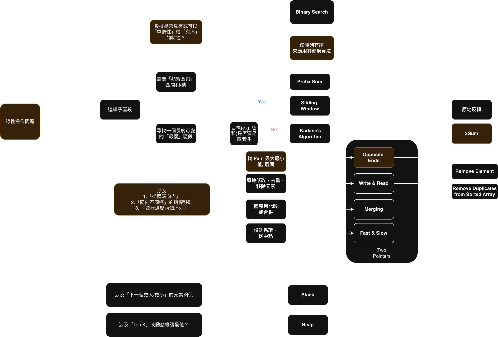

# Leetcode 15. 3Sum
https://leetcode.com/problems/3sum/?envType=study-plan-v2&envId=top-interview-150

### 思考決策圖



### 解題思路
1.  **排序與固定錨點 (for i)**
    先將 `nums` 排序。用一個 `for` 迴圈遍歷陣列，固定住 `nums[i]` 作為「錨點」。
    * **`i` 的去重**：在此迴圈的**開頭**檢查，如果 `i > 0` 且 `nums[i] == nums[i-1]`，表示這個錨點的工作「已經被做過了」（因為 `nums[i-1]` 已經找過所有答案），直接 `continue` 換下一個 `i`。

2.  **雙指針逼近 (l 和 r)**
    在 `i` 之後的區間 `[i+1, n-1]` 上，設定 `l = i+1` 和 `r = n-1` 兩個指針。
    * 計算 `sum = nums[i] + nums[l] + nums[r]`。
    * 若 `sum < 0`，總和太小，`l` 右移 (`l += 1`)。
    * 若 `sum > 0`，總和太大，`r` 左移 (`r -= 1`)。
    * 若 `sum == 0`，找到一組答案，將 `[nums[i], nums[l], nums[r]]` 加入結果。**然後，執行第 3 點的去重**。

3.  **答案去重 (l 和 r)**
    這一步**只在 `sum == 0` 找到答案後**才執行，目的是跳過所有「內容重複」的元素。
    * **`l` 的去重**：`while l < r` 且 `nums[l] == nums[l+1]`，`l` 持續右移 (`l += 1`)，跳過所有和剛才答案中 `nums[l]` 一樣的數字。
    * **`r` 的去重**：`while l < r` 且 `nums[r] == nums[r-1]`，`r` 持續左移 (`r -= 1`)，跳過所有和剛才答案中 `nums[r]` 一樣的數字。
    * **關鍵**：在兩個 `while` 迴圈結束後，**必須再各走一步** (`l += 1`, `r -= 1`)，這樣 `l` 和 `r` 才會真正踏上「新的、不一樣的」數字，開始尋找下一組答案。


### Solution

```python
class Solution:
    def threeSum(self, nums: List[int]) -> List[List[int]]:
        nums = sorted(nums)
        n = len(nums)
        
        # nums[i] + nums[l] + nums[r] > 0 -> reduce r
        # nums[i] + nums[l] + nums[r] < 0 -> increase l
        # [-4, -1, -1, 0, 1, 2]
        # i < l < r
        res = []
        for i in range(n):

            if i > 0 and nums[i] == nums[i-1]:
                continue
                
            # i : -1
            # -1, 0, 1, 2
            # -1 (curr) + -1 (left) + 2 (right) = 0
            # -1 (curr) + 0 (left + 1) + 1 (right-1) = 0
            l = i + 1
            r = n - 1
            while l < r:
                
                currsum = nums[l] + nums[r] + nums[i]
                
                
                if currsum == 0:
                    res.append([nums[i], nums[l], nums[r]])
                    # 有可能 currsum == 0, 但移動 r 或 l 都可以得到0的情況？
                    # 重複的可能不只一個
                    while l < r and nums[l] == nums[l+1]:
                        l += 1
                    
                    while l < r and nums[r] == nums[r-1]:
                        r -= 1
                    
                    l+=1
                    r-=1

                elif currsum > 0: # > 0 -> r--
                    r -= 1
                else:
                    l += 1
                        
        return res
```
