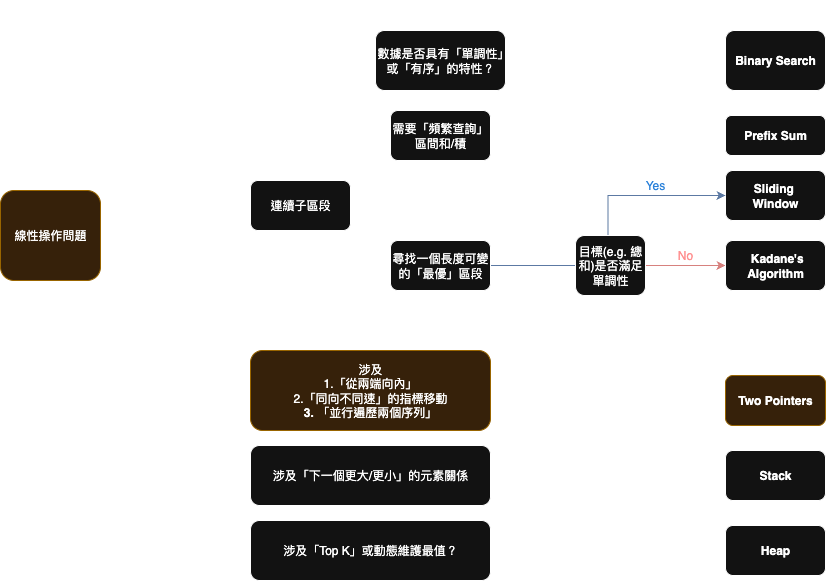

# Leetcode 189. Rotate Array



## 解題思路
k 次反轉法的**底層實現**正是依賴於 **Two Pointers (雙指標)** 思想，我們通常會用 `left` 和 `right` 這兩個指標來完成「反轉」這個核心操作。

### 結合 Two Pointers 的k次反轉

現在，我們用 `nums = [1,2,3,4,5,6,7]` 和 `k = 3` 這個例子，來看看 `left` 和 `right` 指標是如何在三個步驟中移動的。

#### 第一步: 反轉整個陣列 (Reverse the whole array)
這部分與 Two Pointers 的運作原理相同，請參考 [Two Points 筆記](https://hackmd.io/@CGJmXn_nQcGke6vB3srVcw/SkFALFn6eg)

#### 第二步: 反轉前 k 個元素 (Reverse the first k element)

這個操作等同於呼叫 `reverse(nums, 0, 2)`，因為 `k=3`，所以範圍是索引 `0` 到 `2`。

  * **初始狀態**:
    `left` 在索引 `0` (`值=7`)，`right` 在索引 `2` (`值=5`)。
    `[7, 6, 5,  4, 3, 2, 1]`
    `↑`   `↑`
    `left``right`

<!-- end list -->

1.  交換 `nums[0]` 和 `nums[2]` → `[5, 6, 7, 4, 3, 2, 1]`
2.  `left` 右移, `right` 左移。`left` 在 `1`，`right` 在 `1`。`left < right` 條件不成立，迴圈結束。

<!-- end list -->

  * **操作後結果**: `[5, 6, 7, 4, 3, 2, 1]`

#### **第三步: 反轉剩下的 n-k 個元素 (Reverse the remaining n-k elements)**

這個操作等同於呼叫 `reverse(nums, 3, 6)`，範圍是從索引 `k=3` 到 `n-1=6`。

  * **初始狀態**:
    `left` 在索引 `3` (`值=4`)，`right` 在索引 `6` (`值=1`)。
    `[5, 6, 7,  4, 3, 2, 1]`
    `↑`       `↑`
    `left`    `right`

<!-- end list -->

1.  交換 `nums[3]` 和 `nums[6]` → `[5, 6, 7, 1, 3, 2, 4]`
2.  `left` 右移, `right` 左移。`left` 在 `4`，`right` 在 `5`。
3.  交換 `nums[4]` 和 `nums[5]` → `[5, 6, 7, 1, 2, 3, 4]`
4.  `left` 右移, `right` 左移。`left` 在 `5`，`right` 在 `4`。`left < right` 條件不成立，迴圈結束。

<!-- end list -->

  * **操作後結果**: `[5, 6, 7, 1, 2, 3, 4]`
---

### 解題範例
#### 使用預先定義好的 deque 資料結構
```python
from collections import deque

class Solution:
    def rotate(self, nums: List[int], k: int) -> None:
        """
        Do not return anything, modify nums in-place instead.
        """

        dq = deque(nums)

        for i in range(k):
            last = dq.pop()
            dq.appendleft(last)

        # In-place Modification
        nums[:] = list(dq)
```
然而這個寫法指向是基礎的element 遷移操作，並沒有直觀的使用 two pointers 演算法的效果，無法很好的呈現 rotated 這種概念

以下這段程式碼更能簡潔的替換成 `dq.rotate(k)` 這種操作
```python
for i in range(k):
    last = dq.pop()
    dq.appendleft(last)
```


            


#### 使用reverse
```python
class Solution:
    def rotate(self, nums: List[int], k: int) -> None:
        """
        Do not return anything, modify nums in-place instead.
        """
        
        # 例外處理：由於 k 值大小可能超過 List 的長度，因此我們應該要除n取整
        n = len(nums)
        k = k % n
        
        
        # Step 1. 翻轉整個陣列
        nums[:] = list(reversed(nums)) 
        # 要注意的是 reversed 回傳的是迭代器
        # 一定要注意使用 in-place modification, 否則並不會修改到外部的nums
        
        
        # Step 2. 根據 k 值, 拆分成左右半邊進行翻轉
        nums[:k] = reversed(nums[:k])
        nums[k:] = reversed(nums[k:])
```

