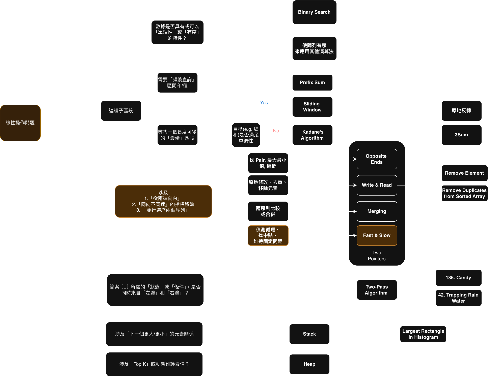

# Leetcode 19. Remove Nth Node From End


### Solution 1. DP
> 利用 DP 紀錄每個點的指標後，在對距離end N 位置的指標進行替換

```python
class Solution:
    def removeNthFromEnd(self, head: Optional[ListNode], n: int) -> Optional[ListNode]:
        node = head
        #  [1, 2, 3, 4, 5] # 4
        #   ------->[4]
        memo = []

        while node is not None:            
            memo.append(node)            
            node = node.next
        total_len = len(memo)

        # 5 - 2 = 3
        # 5 - 2 + 1
        target = total_len - n

        if target == 0:
            return head.next

        if total_len <= n:
            return ListNode().next
        
        memo[target-1].next =  memo[target-1].next.next


        return head
```

### Solution 2. Fast and Slow Pointers
> 利用快慢指針的特性，我們只要讓 fast 跟 slow 指針差距 N 步，這樣子當 fast 指針走到底時， slow 會正好停在我們目標的前一個位置，這樣子我們就可以利用 slow.next = slow.next.next 來快速替換


```python
class Solution:
    def removeNthFromEnd(self, head: Optional[ListNode], n: int) -> Optional[ListNode]:        
        dummy = ListNode(0, next=head)
        slow = dummy
        fast = dummy

        for i in range(n):
            fast = fast.next
        
        while fast.next is not None:
            fast = fast.next
            slow = slow.next

        slow.next = slow.next.next


        return dummy.next            
```