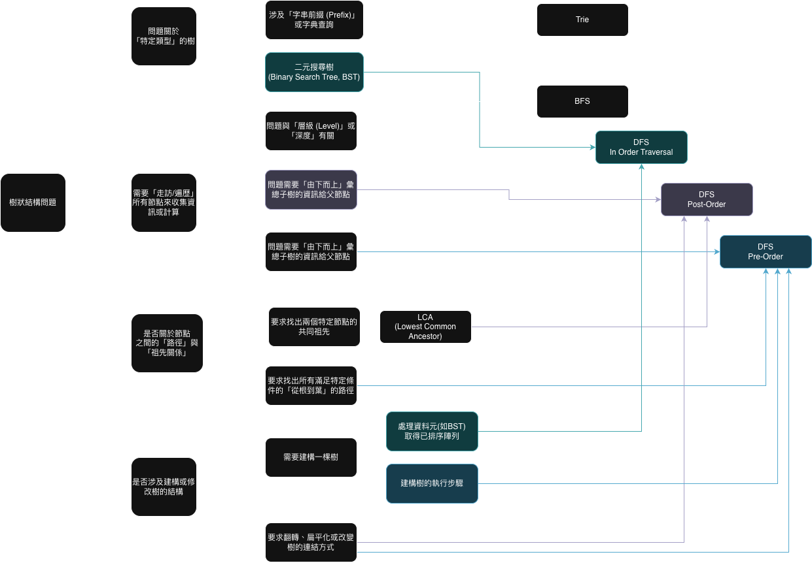

# LeetCode 530. Minimum Absolute Difference in BST
https://leetcode.com/problems/minimum-absolute-difference-in-bst


## 模式辨識



## 解法

這題解法是透過利用 BST 的特性:[對於一個**有效的 BST**，經過中序遍歷的結果**必然是一個由小到大排序好的數列**]，來將BST 轉化為有序數列 (sorted list), 在一組排序好的數字中，最小的差值一定發生在「相鄰」的兩個數字之間。 


### In-order Traversal
中序遍歷 (In-order Traversal) 是樹狀結構中最基本也最重要的遍歷方式之一。

#### 核心概念與口訣
中序遍歷拜訪一個樹（或子樹）的順序永遠不變，口訣就是：**「左、中、右」**。

意思就是，對於任何一個節點，你必須：

1.  **左 (Left)**：先去處理完它**所有的左邊**子樹。
2.  **中 (Root)**：處理完左邊後，回過頭來處理**自己** (這個節點)。
3.  **右 (Right)**：最後再去處理它**所有的右邊**子樹。

這個規則是**遞迴 (recursive)** 的，也就是說當你處理左子樹或右子樹時，你也要對那個子樹套用同樣的「左、中、右」規則。

-----

#### 例子：一個有效的二元搜尋樹 (BST)

我們就用前一個討論中的有效 BST 來當例子。

```
      10
     /  \
    5    20
        /
       11
```

**遍歷步驟（跟著電腦的思路走）：**

1.  **從根節點 `10` 開始。**
      * **左**：`10` 有左邊嗎？有，是 `5`。所以先去處理 `5`。
2.  **來到節點 `5`。** (對 `5` 套用「左、中、右」)
      * **左**：`5` 有左邊嗎？沒有。
      * **中**：既然沒有左邊，就處理自己。**印出 `5`**。
      * **右**：`5` 有右邊嗎？沒有。
      * 節點 `5` 處理完畢，回到 `10`。
3.  **回到節點 `10`。**
      * **左**：`10` 的左邊 (`5`) 剛剛已經全部處理完了。
      * **中**：現在處理自己。**印出 `10`**。
      * **右**：`10` 有右邊嗎？有，是 `20`。所以現在去處理 `20`。
4.  **來到節點 `20`。** (對 `20` 套用「左、中、右」)
      * **左**：`20` 有左邊嗎？有，是 `11`。所以先去處理 `11`。
5.  **來到節點 `11`。** (對 `11` 套用「左、中、右」)
      * **左**：`11` 有左邊嗎？沒有。
      * **中**：處理自己。**印出 `11`**。
      * **右**：`11` 有右邊嗎？沒有。
      * 節點 `11` 處理完畢，回到 `20`。
6.  **回到節點 `20`。**
      * **左**：`20` 的左邊 (`11`) 剛剛已經全部處理完了。
      * **中**：現在處理自己。**印出 `20`**。
      * **右**：`20` 有右邊嗎？沒有。
      * 節點 `20` 處理完畢，回到 `10`。
7.  **回到節點 `10`。**
      * `10` 的左、中、右都處理完了。
8.  **遍歷結束。**

最終印出的順序是： **`5, 10, 11, 20`**。


### 程式碼實現 (Python)

這個「左、中、右」的遞迴思想可以非常直觀地寫成程式碼。

```python
def inorder_traversal(node):
    # 如果節點是空的，就直接返回
    if not node:
        return

    # 1. 左：遞迴處理左子樹
    inorder_traversal(node.left)

    # 2. 中：處理當前節點 (例如，印出它的值)
    print(node.val)

    # 3. 右：遞迴處理右子樹
    inorder_traversal(node.right)

```

## Comparision with Other Traversal Methods

| Method | Order | Application |
|-|-|-|
| In-Order | 左 -> 中 -> 右 | 取得排序結果 <br/> e.g. LeetCode 530 |
| Pre-order | 中 -> 左 -> 右 | 建立/複製樹 <br/> e.g. Leetcode 108 |
| Post-order | 左 -> 右 -> 中 | 刪除一棵樹 |


### Templates
```python
# Pre-order: 中 -> 左 -> 右
def preorder_traversal(node):
    if not node: return
    print(node.val)  # 處理自己
    preorder_traversal(node.left)
    preorder_traversal(node.right)

# In-order: 左 -> 中 -> 右
def inorder_traversal(node):
    if not node: return
    inorder_traversal(node.left)
    print(node.val)  # 處理自己
    inorder_traversal(node.right)

# Post-order: 左 -> 右 -> 中
def postorder_traversal(node):
    if not node: return
    postorder_traversal(node.left)
    postorder_traversal(node.right)
    print(node.val)  # 處理自己
```